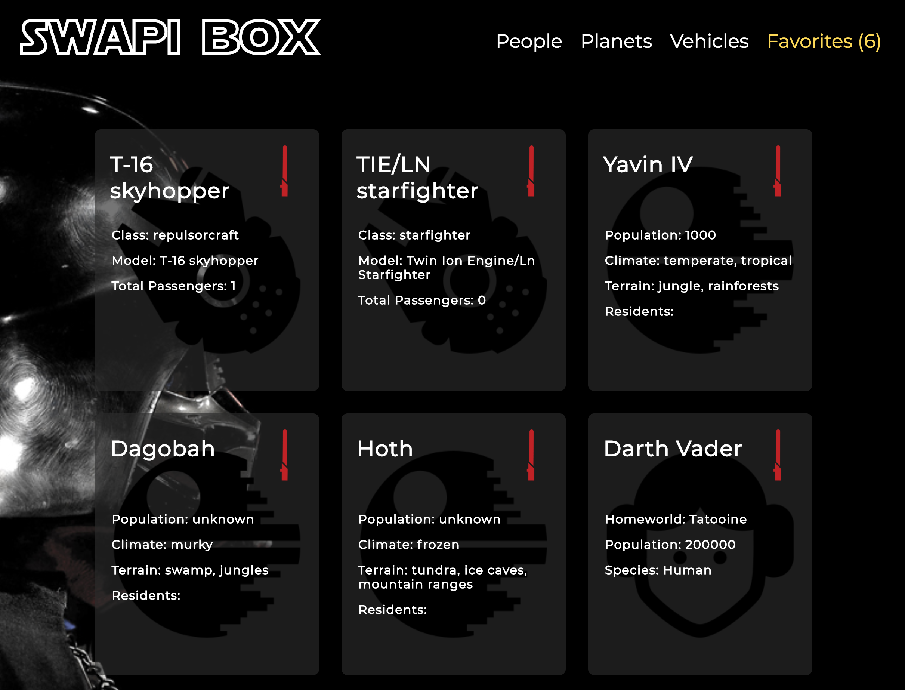

# SWAPI Box 

## Synopsis

SWAPI Box uses the Star Wars API to display information about the people, planets, and vehicles from the Star Wars franchise. 

### Tools 

* Star Wars data from [SWAPI](https://swapi.co/documentation)
* Star Wars icons from [Jory Raphael](https://dribbble.com/shots/1308281-Free-Star-Wars-Icons)

### *Example* 

---

## Contributors

Daniela Carey

_(**Turing School of Software & Design Front-end Engineering project - Mod 3:** [SWAPI Box Project Spec](http://frontend.turing.io/projects/swapi-box.html))_ 

